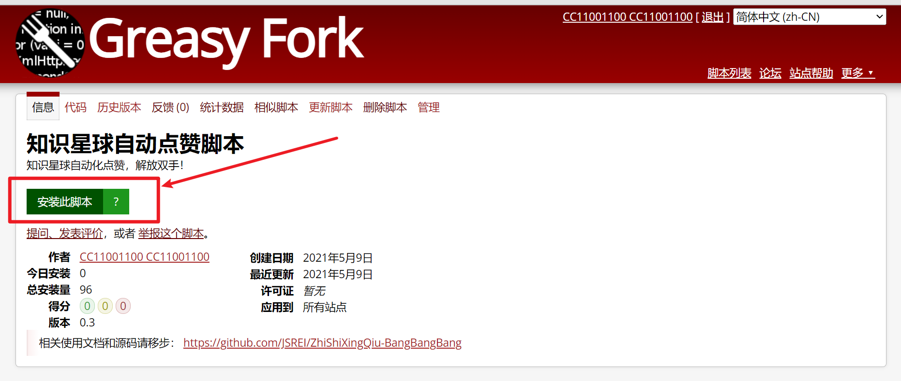
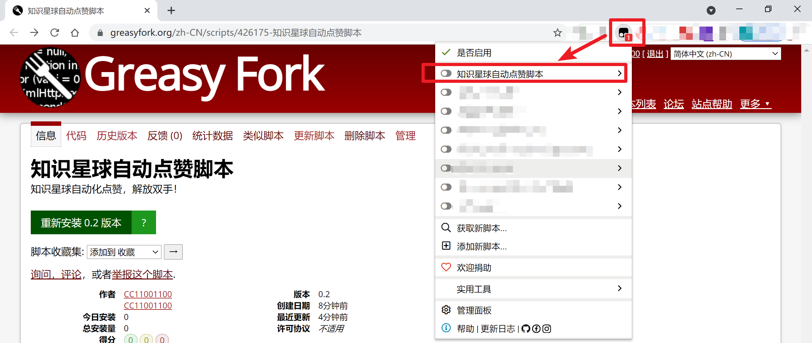
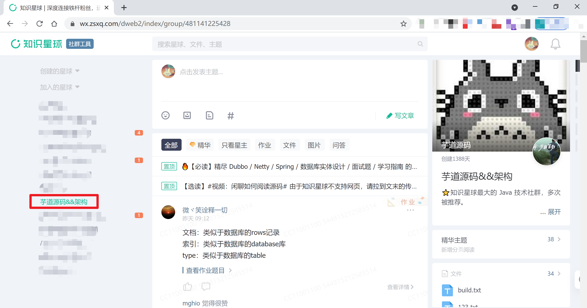
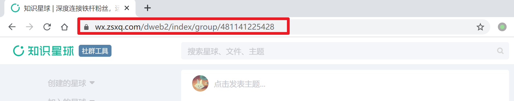
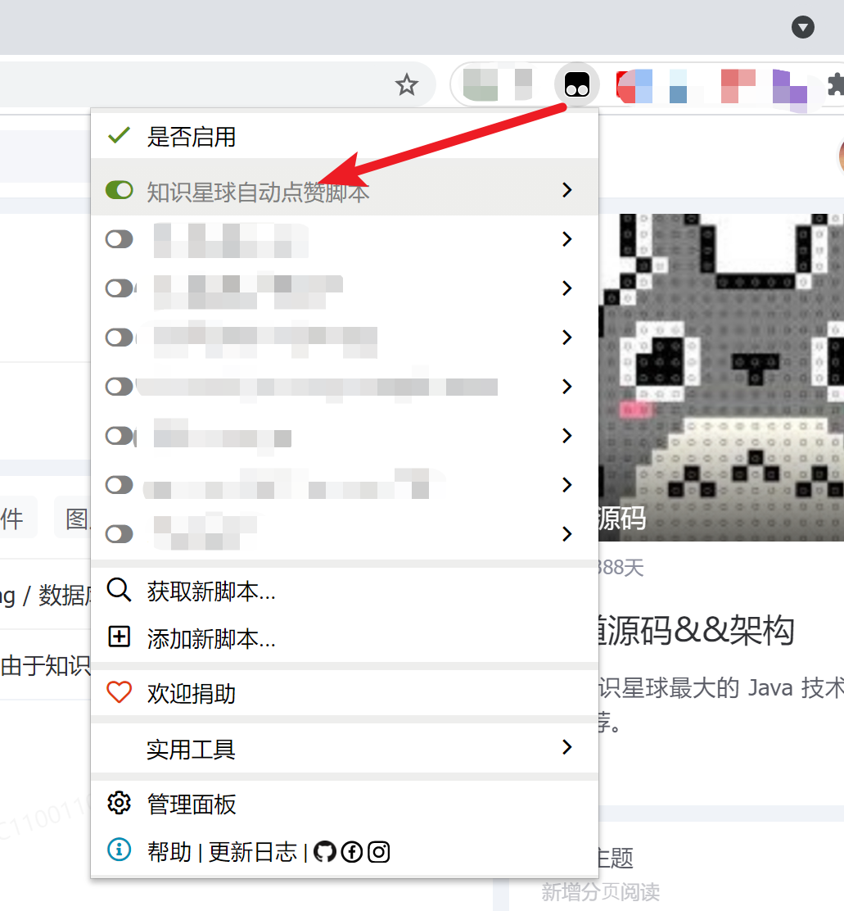
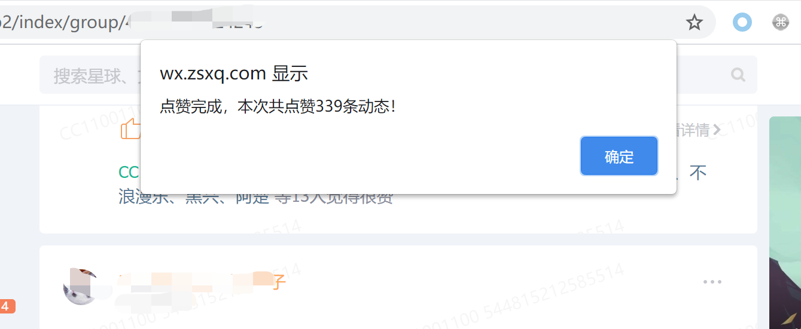

# 知识星球自动点赞脚本

# 一、安装
脚本已上传到油猴官方商店，在商店安装脚本即可：  

[https://greasyfork.org/zh-CN/scripts/426175](https://greasyfork.org/zh-CN/scripts/426175)  

# 二、使用 

第一步，先将本油猴脚本置于禁用状态：  

  

第二步，然后访问知识星球的官网：

[https://wx.zsxq.com/](https://wx.zsxq.com/)

登录后会跳转到主页，在左边选择要点赞的星球，单击进入（这里只是随便拿一个星球作为例子）：

注意进入之后地址栏上的链接会变为星球对应的地址：

  

第三步，然后在油猴的管理界面将本脚本打开：  

刷新页面，开始自动刷赞了：

刷赞完成之后会提示本次点赞了多少条动态： 

比如动态比较多的：  

然后把此脚本禁用，把页面关闭即可。

